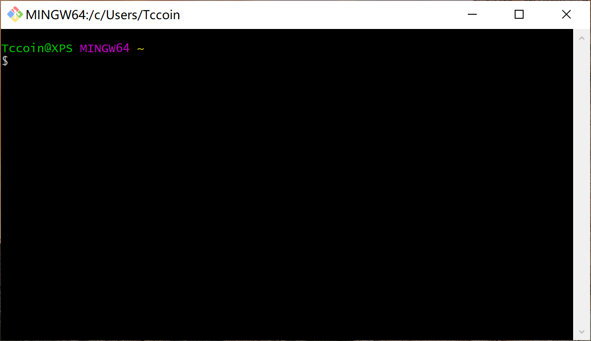
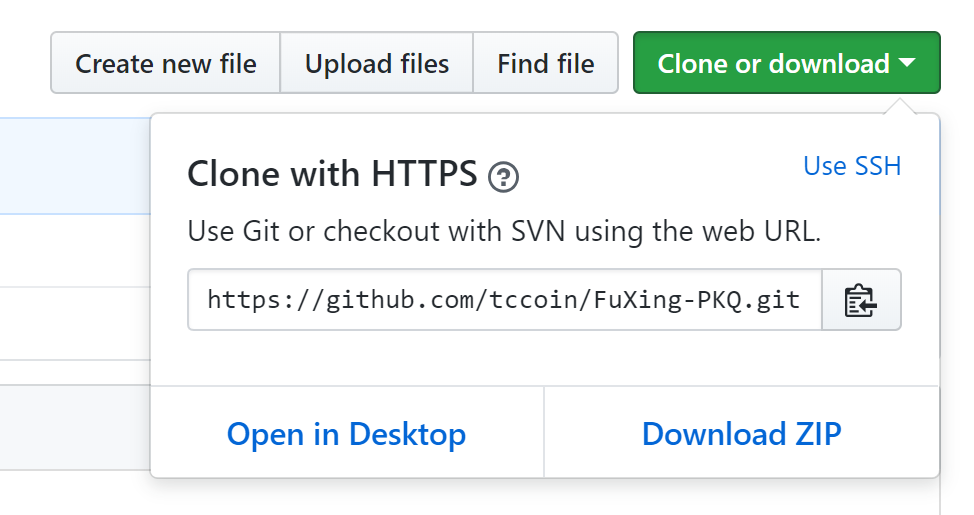
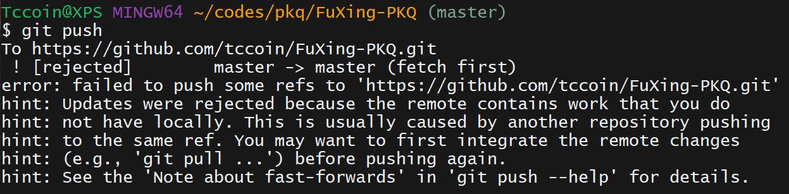

Tccoin@2018-07-10

# Github 半桶水教程

> 随便背几个命令就可以出去吹牛说你会Git啦开心么
> ~~在写教程的这个人自己也不是很懂Git，大家千万别信他写的东西~~

## 〇 概述

首先…请注意`Github != Git`。前者是个网站，后者是个版本控制软件。至于我们为什么要用Github嘛，首先是找个地方放代码，这样就不会发生 临终版.zip 绝对是最终版.rar 真香.7z 这样的事情啦；其次，Git是个很高效的版本控制+协作软件，这个会在文中进一步讨论。

本文的参考内容是廖雪峰的[Git教程](https://www.liaoxuefeng.com/wiki/0013739516305929606dd18361248578c67b8067c8c017b000)~~，当然我这种真正Pro的人都是直接读[Git文档](https://git-scm.com/docs/)的~~。“学有余力”的朋友可以看这个教程深入学习Git。而本文更着重于Github的实践，以[电控学习资料仓库](https://github.com/tccoin/FuXing-PKQ)为例会简单地说说怎么用Github。

那么开始吧。安装Git请见[Git - Downloads](https://git-scm.com/downloads)，下载完你最熟悉的`.exe`安装就是了，安装时有很多可选配置，默认选项就OK。

Git中的`仓库 (Repository)`就是指放项目相关内容的地方。仓库里的一切文件的新建、修改、删除操作都会被记录。Git提供了两种方式来进行操作，一个是Git Bash（命令行），一个是Git GUI（图形界面），不过不要想太多，相信我，GUI难用得要死。（在你的开始菜单里找找）打开Git Bash看看：



但是我平常使用更多是在文件夹空白处右击选Git Bash打开…因为这样的话会直接定位到打开的文件夹。

考虑到很多同学应该从来没接触过bash，这里稍微补充一丢丢bash使用方法：

- 看上图，第一行分为三个部分：`Tccoin@XPS`是用户名，`MINGW64`是编译环境别管它，`~`就是你当前所在的目录（可以理解为你打开了哪个文件夹）。`$`开头表示这一行输入/显示的是命令。
- 切换目录请用`cd your_path`，比如`cd ../abc`。相对路径和绝对路径都可以，相对路径中`.`表示当前目录，`..`表示上一级目录。
- 新建目录请用`mkdir dir_name`，比如`mkdir abc`就在当前目录下新建了一个叫abc的文件夹。

## 一 推拉克隆，基本操作

### git clone
打开仓库的首页，点击“Clone or download”可以看见仓库的地址。



然后打开Git Bash，定位到你想**用来放仓库文件夹的文件夹**，用`git clone`命令我们就可以把Github上的仓库克隆到本地（暂时先理解为下载也没毛病）：

```bash
git clone https://github.com/tccoin/FuXing-PKQ.git
```

稍等片刻然后你就能看见仓库里的文件啦。~~此处略过500种可能出现的连接问题，请尽量自己百度解决。~~

### git add commit push
然后，当你完成修改之后，先确认一下Bash的当前目录是不是**仓库文件夹**，使用`add`,`commit`,`push`这三个命令就可以上传你的修改（逐行输入敲回车运行）：
```bash
git add .
git commit -m "commit message..."
git push origin master
```
- `add`添加的是本次需要提交的内容，一般偷懒都直接用`.`（表示当前目录，即项目根目录），会添加所有修改过（包括新建、删除）的内容。
- `commit`提交改动到仓库，`-m`后面跟的是提交说明，这样便于别人理解你做了什么…所以不要偷懒或者乱写啦。（如果是单词的话不需要加引号）
- `push`就是把本地仓库的改动都推送给远程仓库（本例中就是Github）。后面跟的两项参数有时其实可以省略，但是为了方便大家养成习惯还是都写上为好。其中第一个参数是指要推送的服务器，`origin`就是指从哪来的推送到哪去；第二个参数是推送到哪个分支，分支的概念晚点会再讲，而`master`就是指主分支。

### git pull

仔细想想，pull不就是push的反义词么。push是把本地改动提交到远程仓库，pull就是把远程仓库的改动合并到本地。

## 二 肥肠抱歉，冲突真多

冲突是多人协作一定会碰到的问题…所以请务必学会怎么操作，不然后期不知道怎么解决冲突会很麻烦。

最典型的冲突就是，在你编辑本地文件的同时别人也在编辑，而且别人先你一步提交到Github上了，那么这时你再push就会被服务器拒绝，报错如下图。

解决方案很简单，发现产生冲突后首先`git pull`一下尝试同步远程仓库的改动，如果pull命令没出错，那么恭喜你没事了，接下来你可以重新push。如果又报错了，提示本地仓库和远程仓库在某一个文件上有冲突无法合并，那么我们还得继续`git status`一下看看具体是哪些个文件冲突。然后要做的就是手动解决冲突了，打开冲突了的文件（如果是.md的话请不要用md写作软件打开，加上了冲突信息的.md会很混乱），然后根据Git自动生成的冲突信息进行修改，直接改成正确的就行了。手动解决完所有文件改动冲突后就可以重新add&commit&push啦！

## 三 版本控制，以后再说
咕咕。