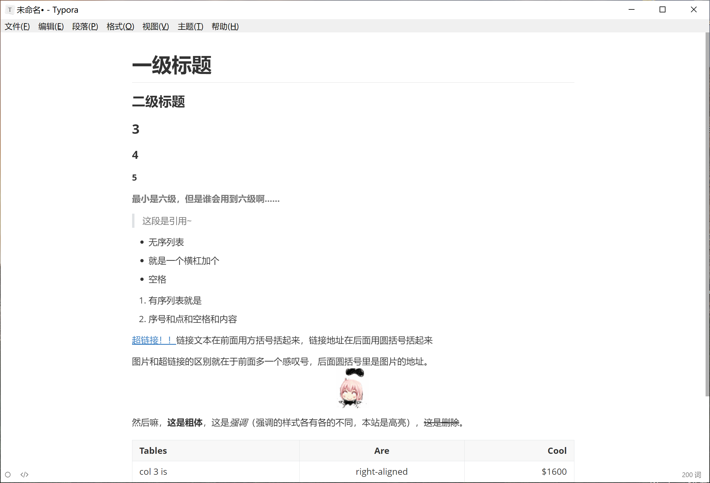

Tccoin@2018-07-10

# Markdown谁不爱呢

大家好呀，这里是写预算写得快死了的项管。今天向大家介绍一下Markdown这个神奇的标记语言，从此和三天崩溃两天摸鱼的M$ Office说再见！

那么，首先你可能想知道Markdown一般在哪使用呢？对啦！就是项目描述。Github及许多大型代码托管网站现在都用Markdown来写readme。原因很简单，markdown可以实现绝大多数文档的功能需求，同时，随便什么文本编辑器打开就写，全球通用。此外再多说一个八卦，当初谷歌啥的几家大公司联合起草了一个Markdown标准，写得差不多了结果给Markdown之爹diss了，说“Markdown是自由的，是任意可拓展的”。什么意思呢？就是Markdown只有一些笼统的通用写法，而各个使用Markdown的软件、网站都可以定义自己的语法来实现更多功能。而业界现在采用最多的是Github提供的GFM标准，下面也主要介绍这些。

## Markdown

下面这段就是Markdown的本体啦。但是看远没有直接上手试快嘛，所以请先下载一个[Typora](https://typora.io/)。不是做广告…只是这个蛮好用的，你当然也可以去网上搜一搜，类似的Markdown写作软件一大堆。然后打开你的Markdown写作软件把下面这段抄进去。

```markdown
# 一级标题
## 二级标题
### 3
#### 4
##### 5
###### 最小是六级，但是谁会用到六级啊……

> 这段是引用~

- 无序列表
- 就是一个横杠加个
- 空格


1. 有序列表就是
2. 序号和点和空格和内容

[超链接！！](http://www.cctv.com/)链接文本在前面用方括号括起来，链接地址在后面用圆括号括起来

图片和超链接的区别就在于前面多一个感叹号，后面圆括号里是图片的地址。


然后嘛，**这是粗体**，这是*强调*（强调的样式各有各的不同，本站是高亮），~~这是删除~~，这是行内代码`i am code!`。

| Tables        | Are           | Cool  |
| ------------- |:-------------:| -----:|
| col 3 is      | right-aligned | $1600 |
| col 2 is      | centered      |   $12 |
| zebra stripes | are neat      |    $1 |

怎么能少了代码块？？
​```C
fake_code_hahahaha();
​```
```

然后神奇的事情就是，你会发现虽然你复制进去的是纯文本，但是Typora自动帮你把Markdown可视化了！粗体什么的完全不用你再点什么按钮慢慢设置！Markdown作为一种**标记语言**的意义就在于通过各种语法来表明一段文字的样式（eg.粗体）、类型（eg.标题）。



然后嘛，你可以保存在本地上（后缀一般用.md）然后试着修改修改，理解一下Markdown语法。

那么你可能要问，不是说好了文本编辑器就行吗，咋还要下个Markdown写作软件。其实，Markdown本身只是一种标记语言，比如在一段文字前后加了`**`就“表明”它被加粗了，你当然也可以脑补一下，但是最直观的办法还是找个软件把它可视化一下不是么。

接下来，进一步学习Markdown的各种格式！除了上面的示例中提到的语法，还有一些比较常见的语法：
- 一行简单的`[toc]`就可以自动生成目录；
- 像这样用美元符包裹公式`$c=\lambda * f$`，可以生成$c=\lambda * f$这样的公式。这个公式的语法叫$\LaTeX$，又是一个超级超级超级大坑…我的建议是，不想学$\LaTeX$的话直接把公式的图片复制进来就行…
- [简明教程 - 简言](https://www.jianshu.com/p/q81RER)，足够你写文章。
- [GFM标准（洋文）](https://guides.github.com/features/mastering-markdown/)，还有些表格什么的语法。

## 最佳实践
嗯，学是一回事用是一回事，身为机器人社的你应该深有体会。方便起见，我在此提供一套比较OK的实践；当然，在兼容的情况下你可以自由选择使用的软件。

> 软件：Typora
> 配置：Typora - 文件 - 偏好设置 - Markdown语法偏好 - 严格模式: true
> 配置：Typora - 文件 - 偏好设置 - 图片插入: 复制图片到./assets文件夹；优先使用相对路径
> 分享：Github上分享直接使用`.md`格式，其它渠道先导出为`.pdf`。

好的，看到这里你很不容易，而这个苦逼作者更不容易。现在请拿出支付宝，给写了这篇文章的老年人转一杯咖啡钱~~￥98蓝山咖啡一杯谢谢~~。

顺带一提，这篇文章是用Markdown写的哟。